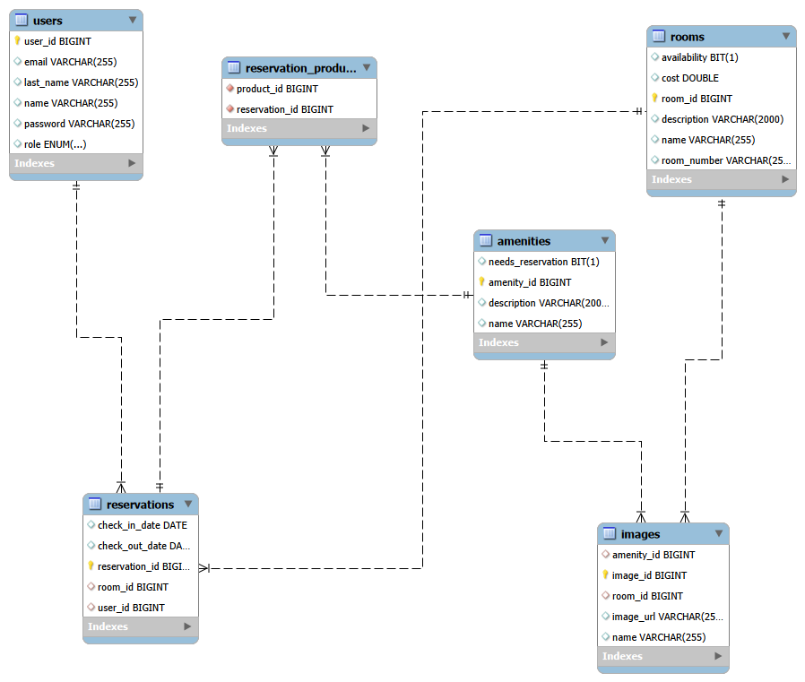
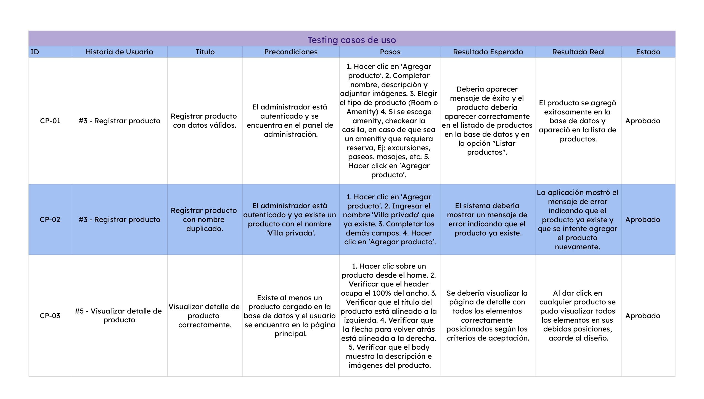
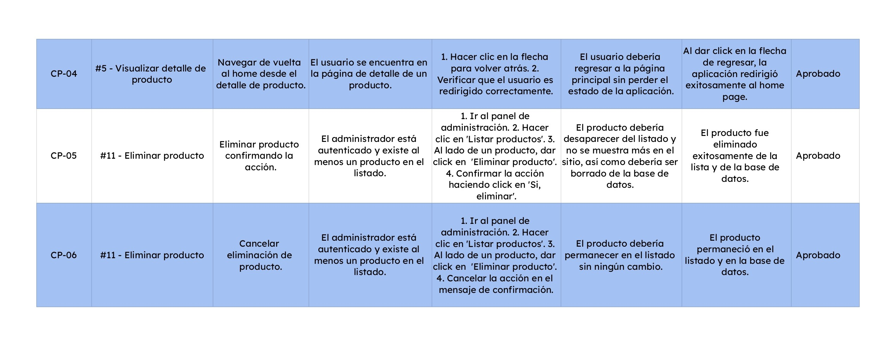
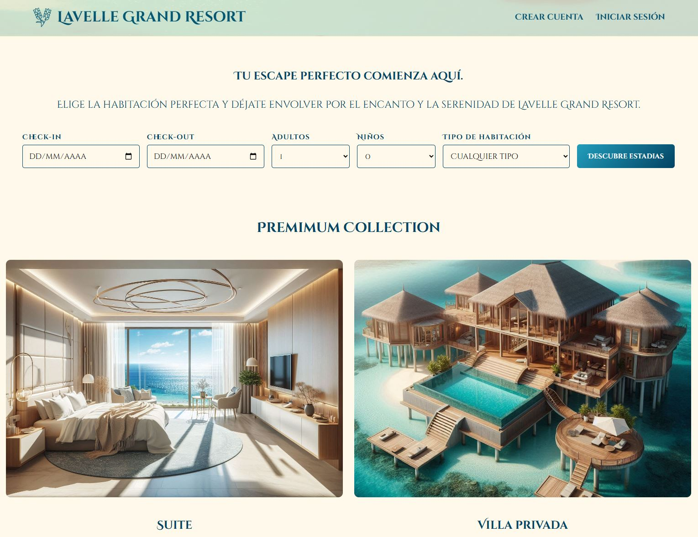
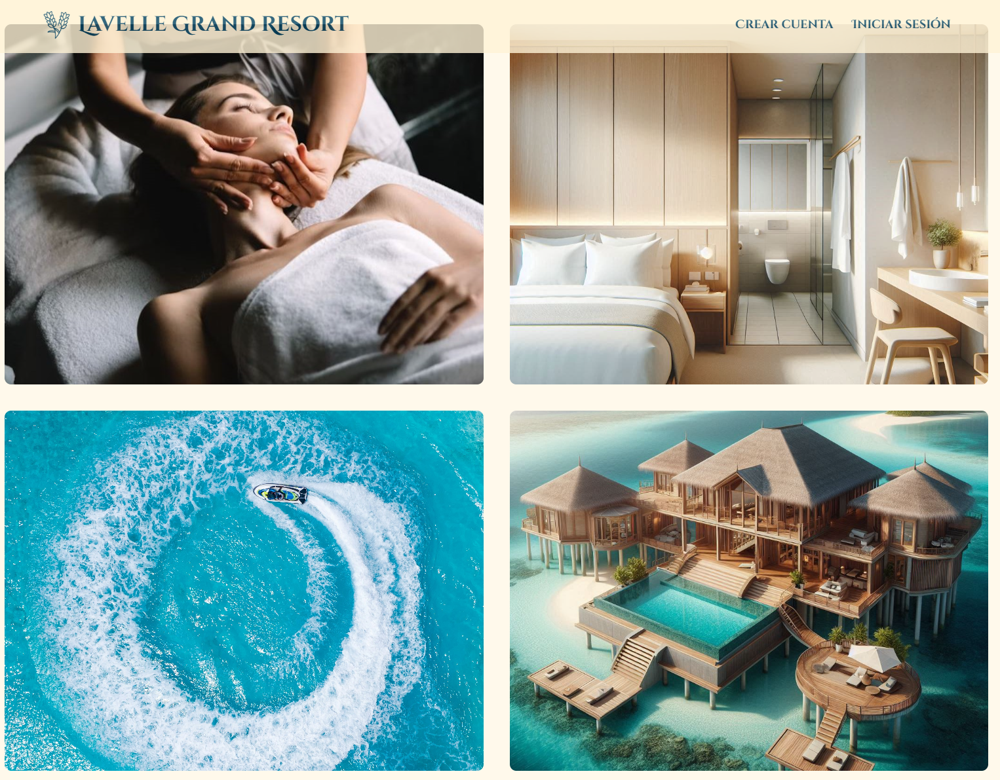
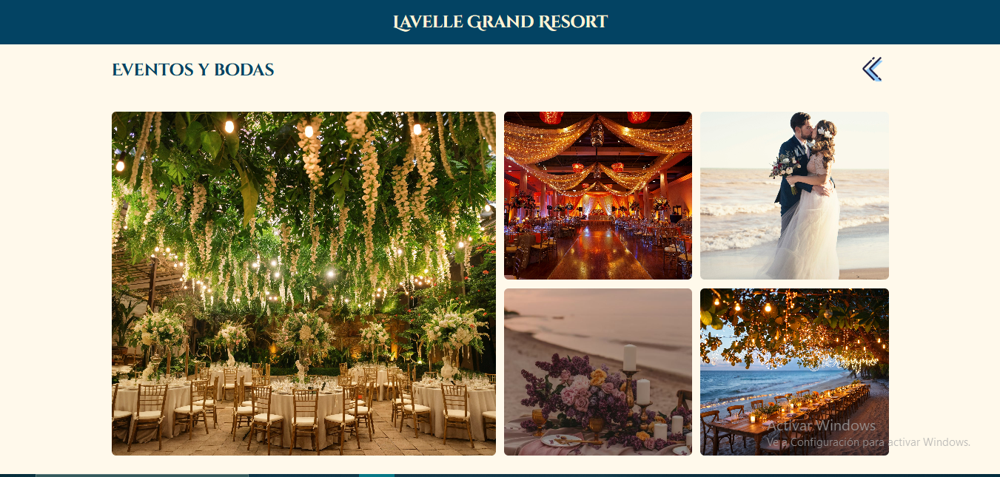
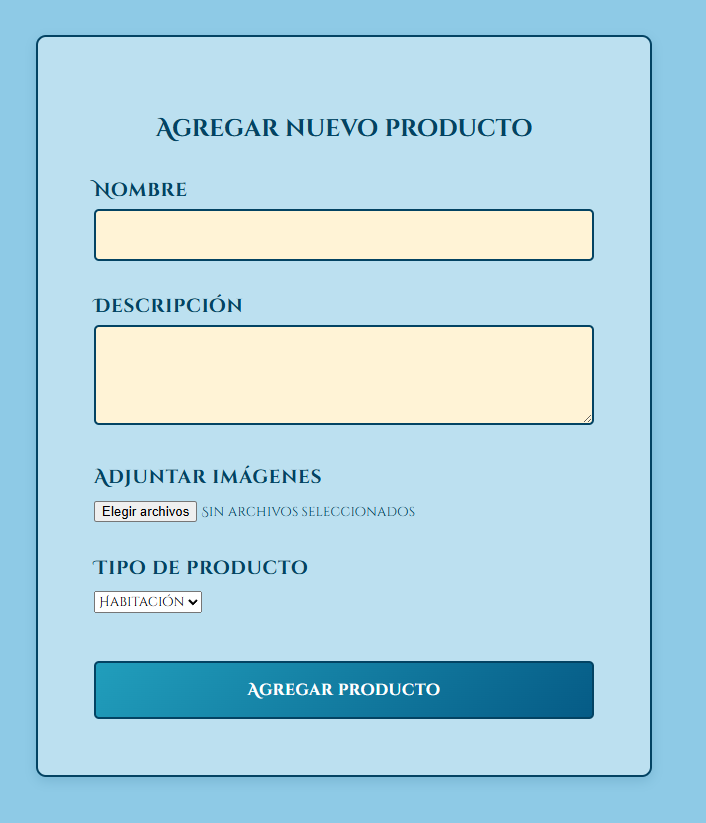
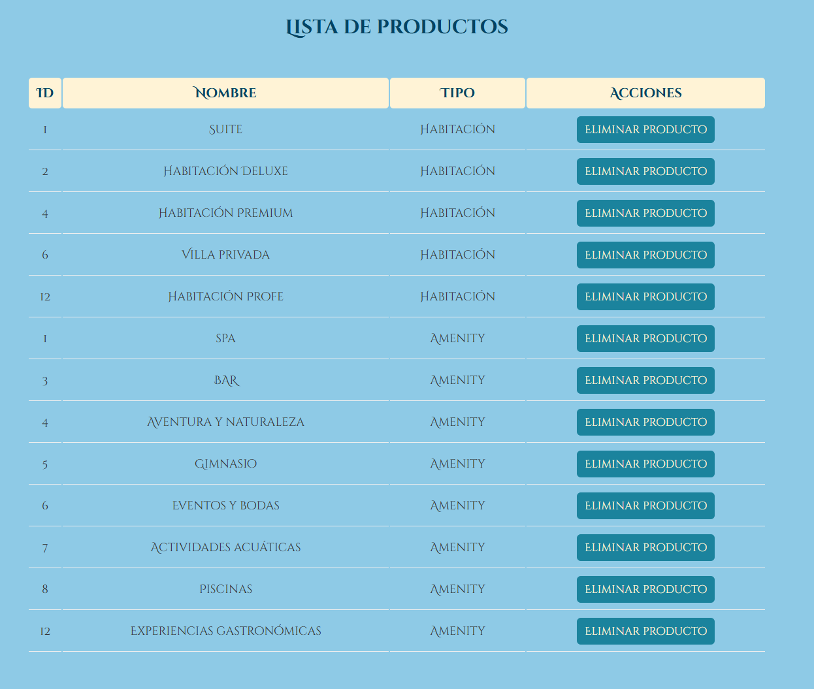
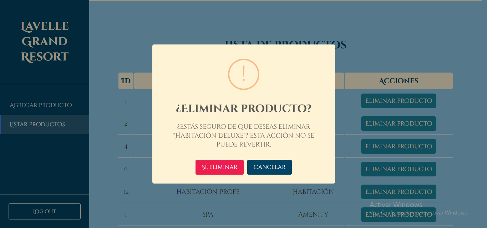

# Lavelle Grand Resort 🌊

Lavelle Grand Resort es una aplicación web de gestión de reservas para un resort de lujo. Los huéspedes pueden reservar diferentes tipos de habitaciones junto con sus amenidades y getionar su reserva. Así mismo los administradores pueden administrar habitaciones, servicios y categorías. 


## Descripción del proyecto 📝
Lavelle Grand Resort era un hotel costero pequeño que ganó popularidad en la isla, distinguiéndose por su gran calidad de servicio, variedad de amenidades y acomodaciones de alta calidad. Con el pasar de los años el hotel se convirtió en un resort de lujo, siendo uno de los más grandes de la isla, manteniendo sus valores principales de calidad de servicio y distinción. 

Gracias al crecimiento que tuvo el hotel, cada vez era más complicado manejar las reservas para los empleados y los huéspedes, y los administradores tenían dificultades para categorizar, organizar y administrar las habitaciones con sus servicios. 

Debido a esta problemática, se decidió digitalizar por completo el resort y diseñar una página web donde los huéspedes pudieran reservar su habitación de preferencia y personalizarla con sus comodidades favoritas. Así mismo, los administradores también pueden manejar toda la parte administrativa del hotel desde su propia página web dentro del mismo resort, ya que el sistema distingue entre los dos tipos de usuario mediante autenticación segura: los huéspedes que gestionan sus reservas, y los administradores, que gestionan el contenido del resort. 
## Diseño e identidad visual 🎨


La paleta de colores está inspirada en los cálidos y atractivos colores que rodean el océano y la arena de la isla, trayendo con ello una sensacion de relajación profunda y sofisticación en su máxima expresión. 


| Color             | Hex                                                                |
| ----------------- | ------------------------------------------------------------------ |
| Azul marino |  #034363 |
| Azul Cian |  #1B839D |
| Azul pacífico |  #219EBC |
| Amarillo suave |  #FECF72 |
| Beige claro |  #FFF3D6 |


## Tecnologías ⚙️
FrontEnd 💻
- React 18.3.1 + vite
- CSS
- Axios 
- React Router
- SweetAlert2 11.22.0

BackEnd ☕
- Java 17
- Spring Boot 3.3.4 
- Lombok
- Spring Security + JWT
- Spring data JPA
- MySQL 8.0.33


## Instalación local ⬇️

Requesitos previos: ✅
- Node.js v18 o superior
- Java JDK 17 o superior 
- MySQL 

Clona mi repositorio: 🗂️
```bash
git clone https://github.com/Caneladelrancho/Lavelle_Grand_Resort_Proyecto.git
cd Lavelle_Grand_Resort_Proyecto
```


## Configuración del  BackEnd 🚪
```bash
cd Back-End
```
1- Crear la base de datos en MySQL:
```sql
   CREATE DATABASE lavelle_grand_resort;
```
2- Correr el script ubicado en la carpeta resources llamado Script_Lavelle_resort, en MySQL. 
```sql
   source resources/Script_Lavelle_resort;
```
3- Configurar el archivo `application.properties.example` y renombrarlo por `application.properties` y completar cada campo con tus credenciales:
```properties
   spring.datasource.url=jdbc:mysql://localhost:3306/lavelle_grand_resort
   spring.datasource.username=TU_USUARIO
   spring.datasource.password=TU_CONTRASEÑA
   jwt.secret=CLAVE_SECRETA_QUE_PASE_POR_PRIVADO
   jwt.expiration=7200000
```
4- Correr el BackEnd
```bash
./mvnw spring-boot:run
```
O en intellij desde la clase main  `ProyectoFinalBackEndApplication` dando click al botón de run.
> El Backend estará disponible en `http://localhost:8080`.
## Configuración del FrontEnd 🧩
```bash
cd Front-End
npm install
```

> **Nota:** Si tu backend corre en un puerto diferente al 8080, 
> actualizá la URL base en el archivo `src/Api.js` en la 
> variable `API_BASE_URL`.

#### Correr el frontend:
```bash
npm run dev
```
> La aplicación estará disponible en `http://localhost:5173`
## Endpoints (API REST) 🔤

| Método | Endpoint | Descripción | Auth |
|--------|----------|-------------|------|
| POST | /api/rooms/add | Agregar habitaciones | ✅ (ADMIN)|
| GET | /api/rooms | Listar todas las habitaciones para mostrarlas al usuario | ❌ |
| GET | /api/rooms/admin | Listar todas las habitaciones para que el admin las gestione | ✅ (ADMIN)|
| DELETE | /api/rooms/{id} | Eliminar habitaciones | ✅ (ADMIN) |
| POST | /api/auth/register | Registrar usuarios | ❌ |
| POST | /api/auth/login | Login y generación de JWT | ❌ |


>Documentacion de Swagger disponible en: `http://localhost:8080/swagger-ui/index.html`
 
## Diagrama de entidades 📚


## Testing 🧪


Las pruebas realizadas para este proyecto corresponden a **tests manuales funcionales**,
ejecutados directamente en el navegador siguiendo un conjunto de casos de prueba 
definidos a partir de las historias de usuario del Sprint 1. Cada caso de prueba 
verifica que el comportamiento real de la aplicación coincida con los criterios de 
aceptación establecidos, cubriendo tanto flujos exitosos como escenarios de error. 
No se implementaron tests automatizados en este sprint.





## Capturas de pantalla 📸









## Autores 👩

- [@VivianArias](https://github.com/Caneladelrancho)


## Licencia 📑

Todos los derechos reservados. Vivian Arias Dev 2026. 

